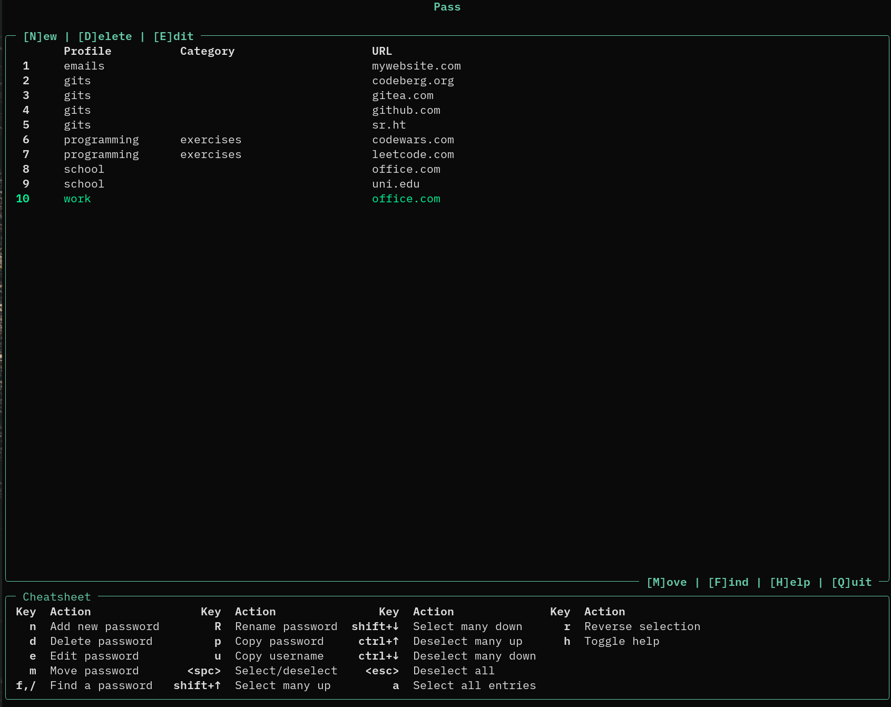
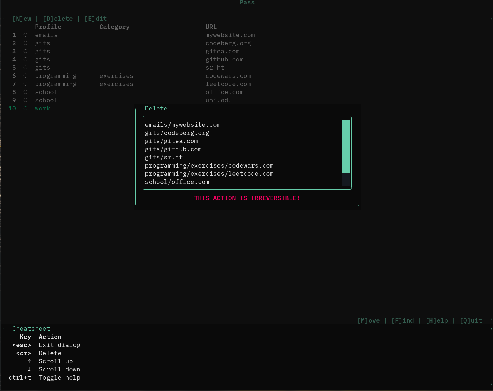
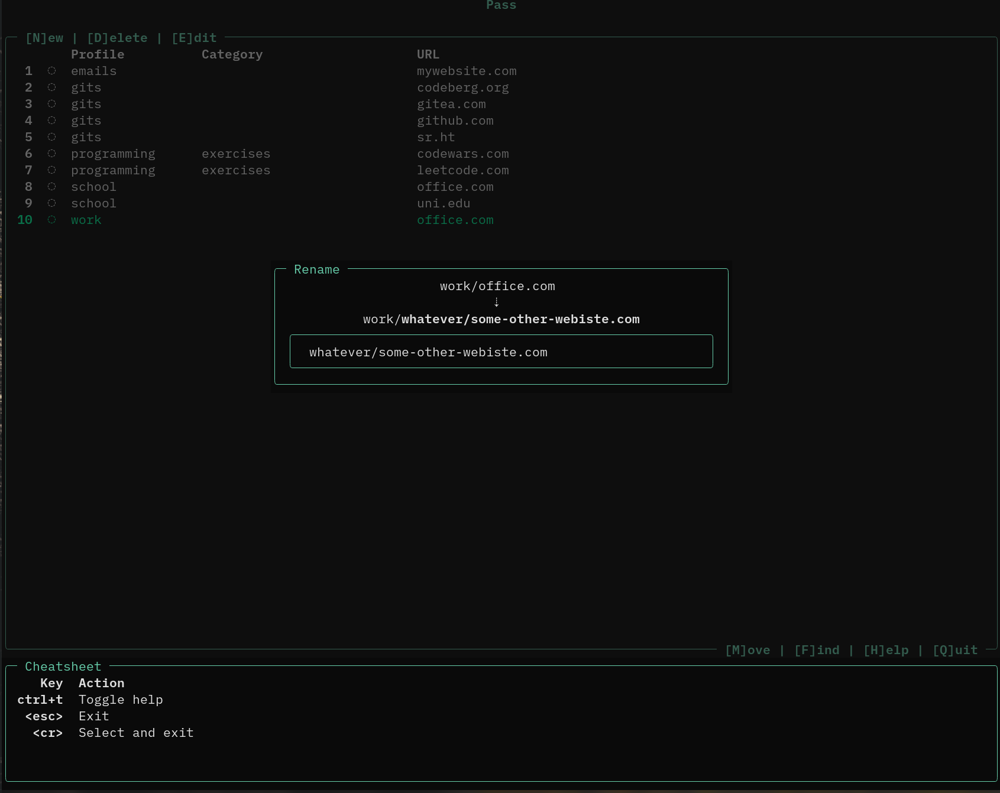

A TUI wrapper over pass.

OS compatibility: any UNIX that you can run pass and a modern terminal on should work.

# Sleek, modern look

# Creating new passwords like in Keepass

# Deleting passwords

# Fuzzy finder

# Moving passwords

# Renaming passwords

